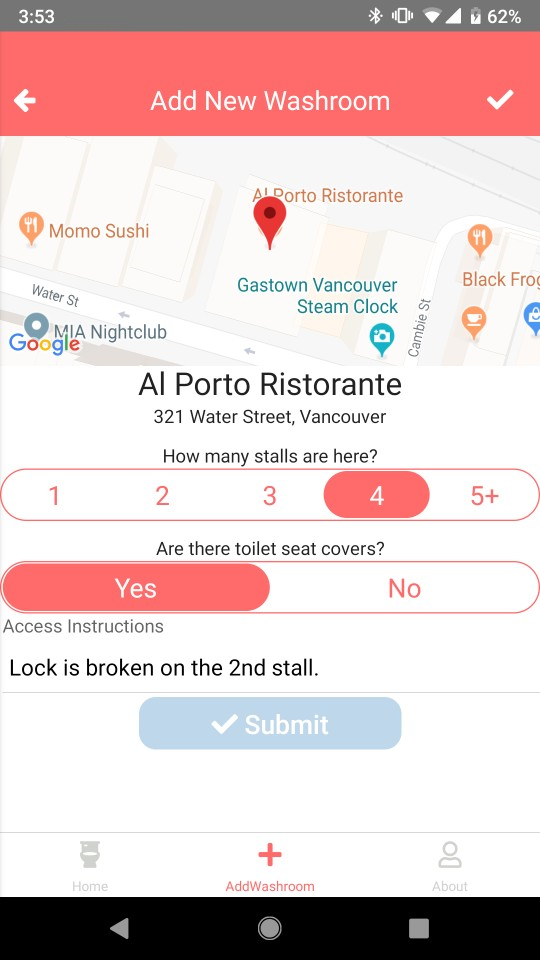
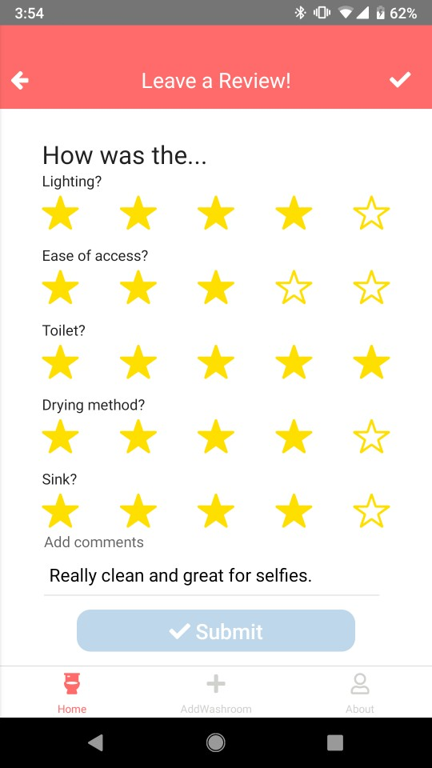
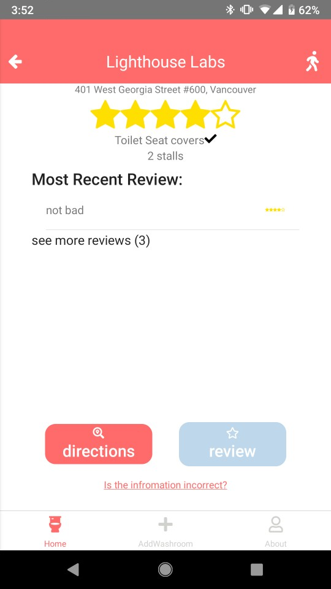
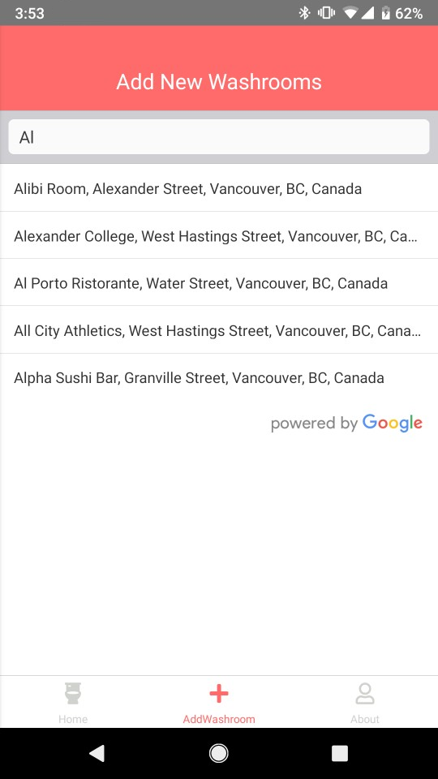

# Loyal Flush

Loyal Flush is a Crowd-Sourced Multi-Platform Mobile Application that finds you the cleanest washroom around, hand-picked by honest users.

## Authors

- Steve Choi | [GitHub](https://github.com/stevechoiio) | [LinkedIn](https://www.linkedin.com/in/stevechoi93/) | [Website](https://choisteve.com)
- Jin Suk Kim | [GitHub](https://github.com/jinsukkim94) | [LinkedIn](https://www.linkedin.com/in/jinsukkim94//)

## Cover


## Screenshots







## Technologies Used

`Back-end Development`:

- GraphCool
- Node.js

`Front-end Development`:

- React.js

## Installation Instructions
Loyal Flush is available in both Play Store and App Store.

- Play Store : https://play.google.com/store/apps/details?id=com.fullrush
- App Store(Test) : https://testflight.apple.com/v1/app/1460198033?build=41110122

Developer options

1. ```yarn```
2. ```react-native link```
3. ```react-native run-ios OR run-android```

- Note: (If you see an index error, please run ```npm start -- --reset-cache``` on another terminal.

4. Enjoy!

## Reflections
